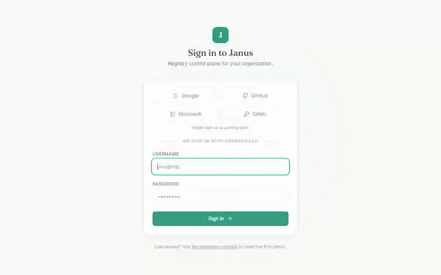
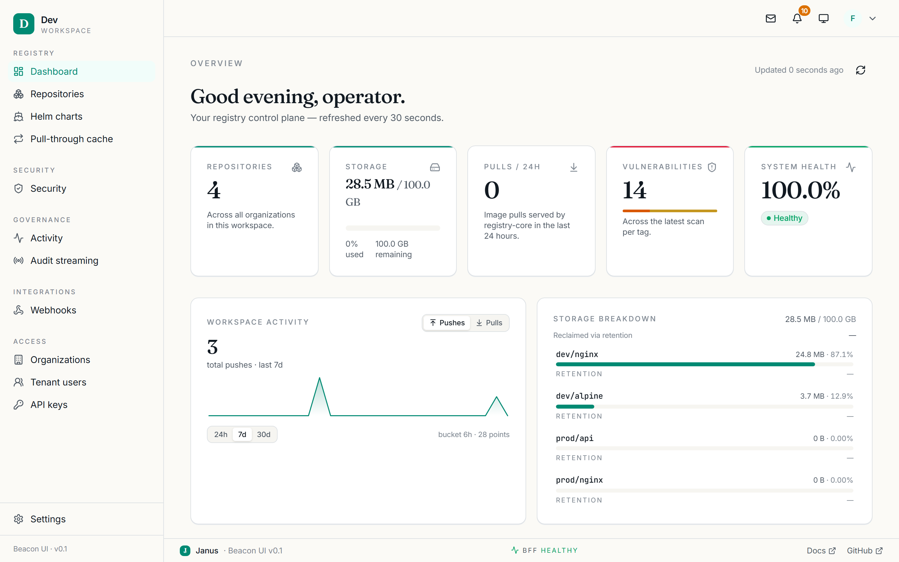

# Quick start

Get a full OCI-Janus stack running locally, create the first admin, and push and
pull your first image — in about five minutes. This is the guided path; for
production deployment see [Self-hosting](SELF-HOSTING.md).

## Prerequisites

- **Docker + Docker Compose v2**
- **`make`** — the dev targets wrap Compose and the bootstrap CLI
- **~4 GB free RAM** for the full stack (Postgres, Redis, RabbitMQ, MinIO, Vault,
  Jaeger, and the registry services)

## 1. Bring up the stack

```bash
git clone https://github.com/steveokay/oci-janus.git
cd oci-janus
make dev-certs              # generate self-signed mTLS certs for local services
docker compose -f infra/docker-compose/docker-compose.yml up -d
make dev-bootstrap          # create the first admin (admin / Admin1234!)
```

What each step does:

1. **`make dev-certs`** writes a local CA + per-service certs to `certs/`.
   Kubernetes deployments use cert-manager instead — see [Deployment](DEPLOYMENT.md).
2. **`docker compose up -d`** brings up Postgres, Redis, RabbitMQ, MinIO, Vault,
   Jaeger, and all 14 registry services on the `registry.events` topic exchange.
3. **`make dev-bootstrap`** runs `registry-auth bootstrap` inside the auth
   container to create the first tenant + admin user. It is idempotent — safe to
   re-run. It prints the **bootstrap tenant id**; note it if you plan to use the
   API or [connect an AI agent](MCP.md).

!!! warning "Dev credentials are local-only"
    `admin / Admin1234!` is the default local bootstrap credential — never use it
    outside a throwaway dev stack. Production bootstrap reads the password from
    stdin; see the [bootstrap runbook](https://github.com/steveokay/oci-janus/blob/main/infra/runbooks/bootstrap-first-admin.md).

## 2. Verify the stack is healthy

Give the services a few seconds to become ready, then check:

```bash
docker compose -f infra/docker-compose/docker-compose.yml ps
```

Every service should read `running` (and `healthy` where a healthcheck is
defined). Two quick smoke checks:

```bash
# The OCI API answers on :8081 — a 200 with an empty body is correct.
curl -sf http://localhost:8081/v2/ && echo "registry OK"

# The dashboard is served on :5173 (Vite dev server).
curl -sf -o /dev/null http://localhost:5173 && echo "dashboard OK"
```

## 3. Log in and push your first image

<figure markdown="span">
  { .off-glb loading=lazy }
  <figcaption>Signing in to the dashboard with the bootstrap admin credentials.</figcaption>
</figure>

```bash
docker login localhost:8081 -u admin -p Admin1234!
docker pull alpine:latest
docker tag  alpine:latest localhost:8081/library/alpine:latest
docker push localhost:8081/library/alpine:latest
```

You should see the layers upload and a final `digest: sha256:…` line. Pull it
back to confirm the round-trip:

```bash
docker rmi localhost:8081/library/alpine:latest
docker pull localhost:8081/library/alpine:latest
```

!!! tip "The repository is created on push"
    You did not have to pre-create `library/alpine` — a push to a new
    `org/repo` creates it, subject to your permissions. You can also create
    repositories from the dashboard.

## 4. See it in the dashboard

Open **http://localhost:5173** and sign in with `admin` / `Admin1234!`.

<figure markdown="span">
  { loading=lazy }
  <figcaption>The dashboard home, with your first repository and recent activity.</figcaption>
</figure>

- **Repositories** lists `library/alpine`. Open it to see the tag you pushed,
  its digest, and size.
- Open the **`latest`** tag and use **Trigger scan** to run a vulnerability scan
  (the dev stack ships a scanner under the `scanner` compose profile).
- **Activity** (under Governance) shows the `push.completed` event you just
  generated.

The full console is documented in [Using the dashboard](guide/index.md).

## Next steps

- **[Using the dashboard](guide/index.md)** — a screen-by-screen tour.
- **[Self-hosting](SELF-HOSTING.md)** — production env vars, secrets, and KEKs.
- **[Environment reference](env-reference.md)** — every configuration variable
  for every service, in one place.
- **[Integrations catalog](integrations/index.md)** — storage, SSO, scanners,
  signing, webhooks, notifications, and more.
- **[Connect an AI agent (MCP)](MCP.md)** — expose the registry to Claude
  Desktop / Cursor.
- **[Migrating v1 → v2](MIGRATION-v1-to-v2.md)** — if you are upgrading.

## Troubleshooting

**A service is stuck restarting.** Check its logs:
`docker compose -f infra/docker-compose/docker-compose.yml logs <service>`.
Most first-run issues are a slow dependency (Postgres/RabbitMQ) — give it a
minute, or `docker compose ... up -d --force-recreate <service>`.

**`docker login` fails with a TLS error.** The dev stack serves the OCI API over
plain HTTP on `:8081`. If your Docker daemon rejects it, add `localhost:8081` to
`insecure-registries` in the Docker daemon config and restart Docker.

**`make dev-bootstrap` says the admin already exists.** That is fine — it is
idempotent. Re-running never clobbers the existing tenant or user.

**The dashboard login errors about a tenant id.** The frontend needs the
bootstrap tenant id baked in at build time; the dev compose file sets it for you.
If you rebuilt the frontend image manually, pass `VITE_DEFAULT_TENANT_ID`.
