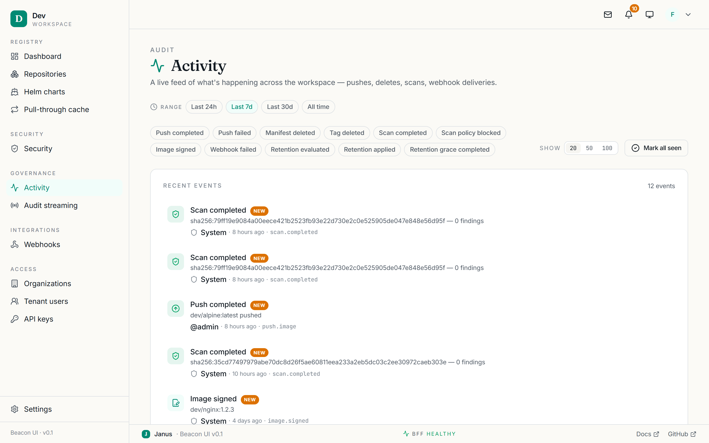
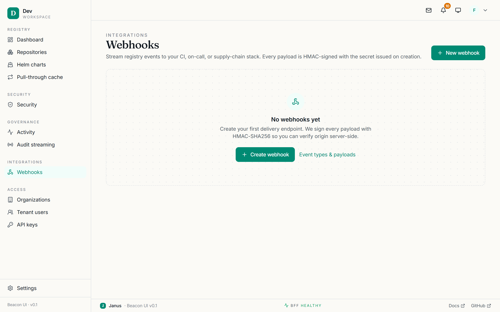

# Operations

Day-to-day operational surfaces: the activity feed, streaming audit events to a
SIEM, the pull-through cache, and outbound webhooks.

## Activity feed

**Sidebar → Governance → Activity** (`/activity`) is a live feed of workspace
events — pushes, deletes, scans, and webhook deliveries.

<figure markdown="span">
  { loading=lazy }
  <figcaption>The Activity feed — a filterable, live view of workspace events.</figcaption>
</figure>

- **Filter by range** — Last 24h / 7d (default) / 30d / All time.
- **Filter by event type** — toggle chips such as `push.image`, `push.failed`,
  `delete.manifest`, `delete.tag`, `scan.completed`, `scan.policy_blocked`,
  `image.signed`, `webhook.delivery_failed`. **Clear** resets them.
- Choose a **page size** (25 / 50 / 100) and **Load older events** to page back.
- **Mark all seen** clears the unread badge on the topbar bell; unread rows carry
  a **new** badge based on when you last looked.

Each row is colour-toned by event type and links to the relevant object where it
makes sense (a push links to the repo). Filters are stored in the URL, so a
filtered view is shareable.

This feed reads from the tamper-evident audit log — see
[Observability](../OBSERVABILITY.md) for the audit hash-chain guarantees.

## Audit streaming (SIEM export)

**Sidebar → Governance → Audit streaming** (`/workspace/audit-export`) ships
every audit event to your SIEM. Full mechanics are in [SIEM
export](../SIEM-EXPORT.md); the console lets you:

- **Enable** streaming and pick a **format** — **syslog (RFC 5424)**, **CEF**, or
  **HTTPS webhook**.
- Set the **target URL** (`syslog+tls://…` or `https://…`).
- For the webhook format, set an **HMAC secret** and/or **bearer token**
  (write-only; HMAC wins if both are set).
- Optionally set **event filters** as JSON (`include`/`exclude`, with trailing
  `.*` wildcards; `exclude` wins).
- **Send test event** to verify delivery and see the rendered payload.

A status card shows health, last-success time, and **DLX depth** — if events are
parked in the dead-letter exchange, **Drain DLX → retry** replays them.

!!! note "Admin-gated"
    Non-admins can view the config but cannot save, test, drain, or clear it.
    Clearing the config stops the stream on the next event.

## Pull-through cache

!!! info "Shown only when wired"
    The sidebar entry appears only if the proxy is configured
    (`PROXY_GRPC_ADDR` set) and you have admin access.

**Sidebar → Registry → Pull-through cache** (`/workspace/proxy-cache`) gives
visibility into images served from upstreams via the proxy. See [Services](../SERVICES.md)
for the proxy design.

- A **stats strip**: cached manifests, storage, distinct upstreams, and total
  pulls served.
- A **cached-images table** — one row per cached `upstream + image + reference`,
  with size, cached/last-pulled times, pull count, scan severity, and signed
  state. Filter by image name; expand a row for the exact `docker pull` commands
  and absolute timestamps.
- **Evict** a row (a typed confirmation) to force the next pull to re-fetch from
  upstream.
- Where enabled, an **upstream policies** card sets **auto-scan** and
  **auto-sign** per upstream.

Clicking an image opens its **detail page** (`/workspace/proxy-cache/{id}`) with
tabs for **Layers/Platforms**, the raw **Manifest** JSON, **Scans**, and
**Signing**.

## Webhooks

**Sidebar → Integrations → Webhooks** (`/webhooks`) delivers registry events to
your own endpoints. Every payload is **HMAC-SHA256 signed** with a secret issued
at creation. Payload shapes are catalogued in [Events](../EVENTS.md).

<figure markdown="span">
  { loading=lazy }
  <figcaption>The Webhooks screen — outbound endpoints with status and delivery history.</figcaption>
</figure>

- **New webhook** — set the URL, pick event subscriptions, and (on save) copy the
  **signing secret**, which is shown once.
- The list shows each endpoint's URL, active/paused status, subscriptions, and
  last delivery.

### Webhook detail

`/webhooks/{id}` is where you operate a single endpoint:

- **Edit** the URL and subscriptions; **Pause/Resume** without editing.
- **Rotate secret** — generates a new secret and invalidates the old one
  immediately (update your receiver first). The new secret is shown once.
- **Delete** the webhook.
- **Send test event** to fire a sample payload and see the result.
- **Recent deliveries** — a table of attempts with status and HTTP code; click a
  row to inspect the full request and response.

!!! note "Admin-gated"
    Creating, editing, pausing, rotating, deleting, and testing webhooks all
    require a workspace-admin role.
