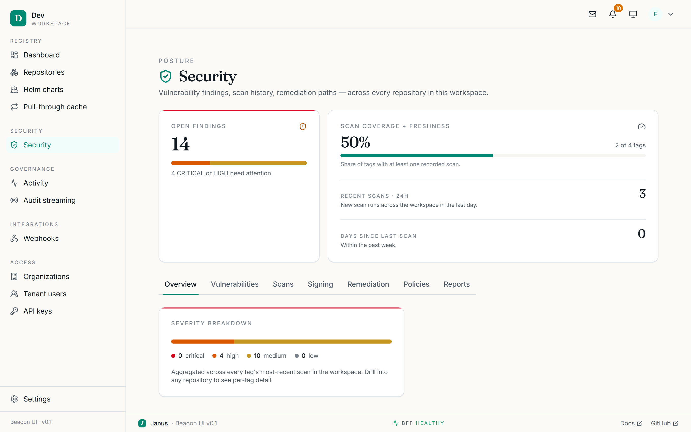
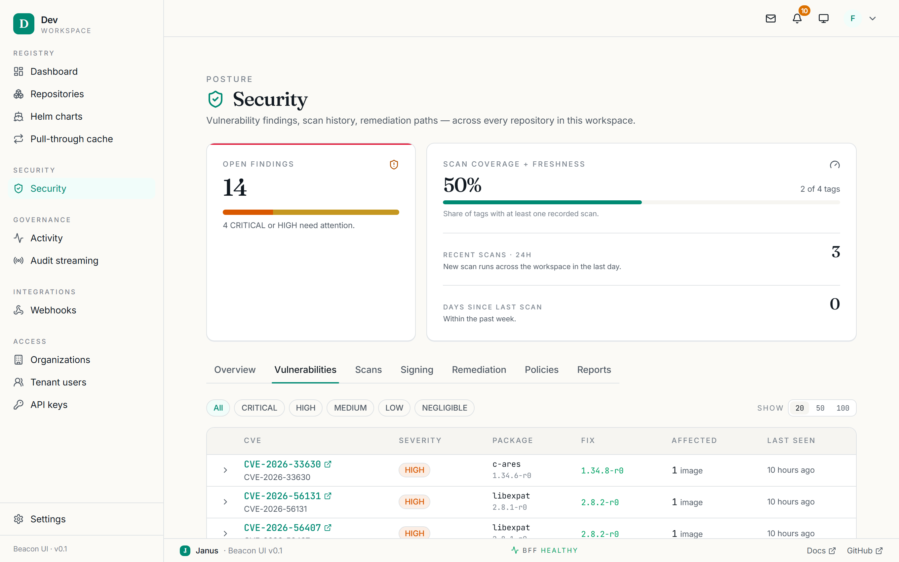
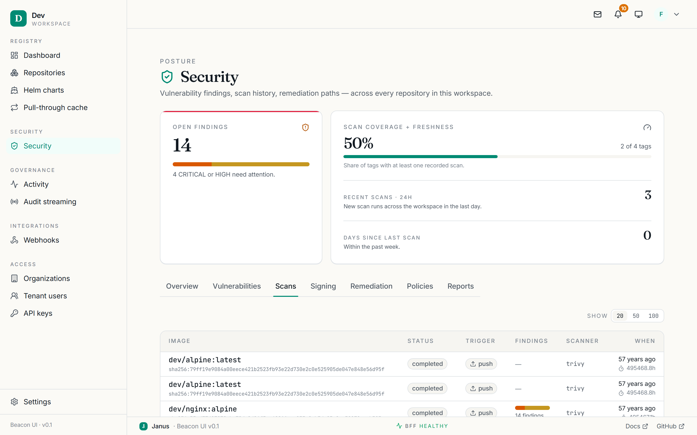

# Security

**Sidebar → Security** (`/security`) is the workspace-wide view of your
vulnerability posture. It aggregates every tag's most recent scan across all
repositories. Per-tag detail lives on each [tag's Security
tab](repositories.md#the-security-tab); this section is the rollup.

<figure markdown="span">
  { loading=lazy }
  <figcaption>The Security overview — the workspace-wide vulnerability posture.</figcaption>
</figure>

<figure markdown="span">
  { .off-glb loading=lazy }
  <figcaption>A tour across the Security tabs — Overview, Vulnerabilities, and Scans.</figcaption>
</figure>

## Posture summary

The top of every Security page shows a persistent summary that does not change
as you switch tabs:

- **Open findings** — a count plus a **severity bar** (CRITICAL / HIGH / MEDIUM
  / LOW). It turns red when any critical/high findings exist, amber for
  medium/low only, and teal when the workspace is clean.
- **Coverage** — how many repositories have a recent scan, the last scan
  timestamp, and which scanner plugin is in use.

Below the summary is a tab rail: **Overview · Vulnerabilities · Scans · Signing
· Remediation · Policies · Reports**. Each is its own URL.

## Overview

A severity breakdown with the full legend and per-severity counts, aggregated
across every tag's most-recent scan. Read-only.

## Vulnerabilities

A workspace-wide CVE browser (`/security/vulnerabilities`).

<figure markdown="span">
  { loading=lazy }
  <figcaption>The Vulnerabilities tab — every CVE across the workspace, filterable by severity.</figcaption>
</figure>

- **Filter** by severity with the **All / CRITICAL / HIGH / MEDIUM / LOW** chips.
- Choose a **page size** (25 / 50 / 100; remembered between visits).
- The table lists **CVE ID, Severity, Package, Fix version, Affected count, Last
  seen**. Expand any row to see the affected `(repo, tag, digest)` triples, each
  a deep link to the tag.

Read-only for all users. Empty when there are no findings at the chosen
severity.

## Scans

The scan-run history (`/security/scans`), newest first, over a 30-day default
window.

<figure markdown="span">
  { loading=lazy }
  <figcaption>The Scans tab — recent scan runs with status, trigger, and results.</figcaption>
</figure>

- Each row: the **image** (`org/repo:tag`), **status** (Pending / Running /
  Complete / Failed), **trigger** (Manual / Webhook / CI), a mini severity bar,
  the **scanner**, and **when** it ran.
- Click a row to jump to that tag's Security tab.

## Signing

A placeholder for workspace-wide signing coverage — per-repo signed-tag
percentages, recent signers, and trusted-key health. The per-tag verify view and
the per-repo trusted-keys editor already exist today (see [Image
signing](../SIGNING.md)); this tab is the aggregate rollup, which lands with a
later phase.

## Remediation

Upgrade suggestions (`/security/remediation`) that aggregate CVE fixes across
packages.

- Each row proposes a **package upgrade** (`from → to`), the **severity** it
  clears, the **count of CVEs closed**, and the **affected count**.
- Expand a row for the CVE list and affected triples (each a deep link).

This is the fastest way to turn a wall of CVEs into a short list of version
bumps. Read-only.

## Policies

The workspace scan-policy editor (`/security/policies`). The same editor is also
embedded under [Settings › Scanning](settings.md#scanning).

- **Scan images on push** — auto-scan toggle.
- **Block on severity** — None / CRITICAL / HIGH / MEDIUM / LOW.
- **Scanner plugin** — Trivy / Grype / Clair, with an optional pinned version.
- **Exempt CVEs** — a list of `CVE-YYYY-NNNN` identifiers to ignore.

!!! note "Admin-gated"
    Non-admins see the policy read-only. Editing requires an admin/owner role.
    The **Save** button stays disabled until you actually change something. If
    you see *"Scan policies aren't wired on this control plane,"* the scanner
    gRPC address is unset in the deployment.

## Reports

On-demand compliance reports (`/security/reports`) — an **SPDX 2.3 SBOM** and a
rendered **PDF**.

- **Generate report** queues a run; the table auto-refreshes every 10 seconds
  while any report is Pending/Running.
- Each row shows the report ID, status, format, and generation time. Once
  **Succeeded**, a **Download** button appears.

!!! note "Admin-gated"
    Generating a report requires a platform-admin/owner role; anyone may
    download a finished report.

See [Vulnerability scanning](../SCANNER.md) for scanner setup, scan policies, and
the SBOM/PDF pipeline.
