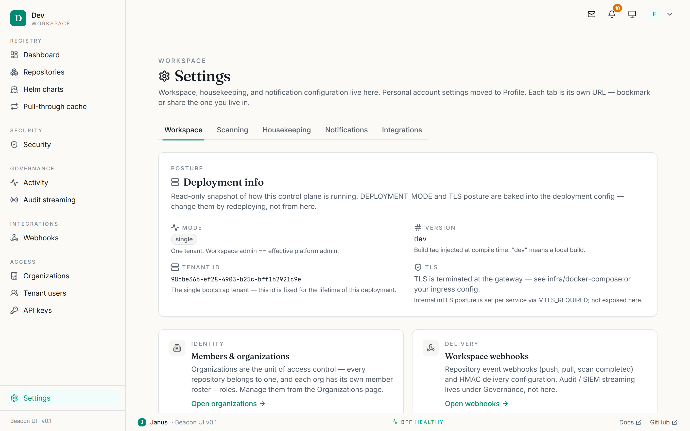
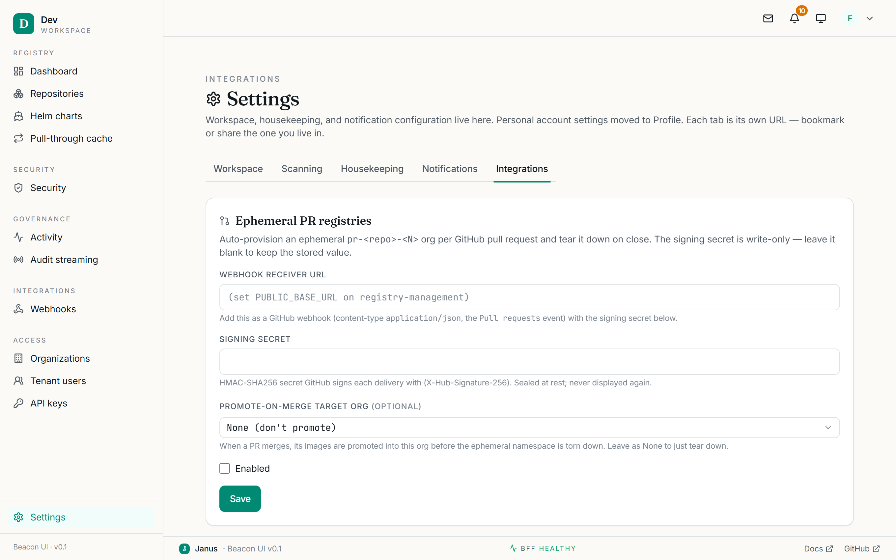

# Settings

**Sidebar → Settings** (`/settings`) is a tabbed area for configuration. Which
tabs you see depends on your role:

| Tab | Who sees it |
|---|---|
| **Workspace** | Admins (any admin role) |
| **Scanning** | Admins |
| **Housekeeping** | Admins |
| **Notifications** | Everyone (personal preferences; admins also see channel config) |
| **Integrations** | **Global admins only** |

Each tab is its own URL, so you can bookmark a specific one.

## Account

Your personal login and security, reachable from the **user menu → Profile**.
Here you can:

- **Change your password.**
- **Enrol TOTP MFA** — scan a QR code with an authenticator app, verify a code,
  and save one-time **backup codes**. You can disable MFA or regenerate backup
  codes later. (An administrator may *require* MFA, in which case you enrol at
  next login.)
- **Manage active sessions** — a table of your live sessions (device label, IP,
  last-active) with per-row **revoke** and a **sign out everywhere else**
  action. Revoking your current session signs you out.

## Workspace

A hub of link cards pointing at the identity, delivery, and lifecycle surfaces —
**Members & organizations**, **Workspace webhooks**, **Retention defaults**, plus
a read-only **SSO posture** card and a **deployment info** card (version,
TLS/mTLS flags). It is a router, not an editor: the actual editing happens on
the linked pages.

<figure markdown="span">
  { loading=lazy }
  <figcaption>The Settings area — the Workspace tab routes to identity and lifecycle surfaces.</figcaption>
</figure>

!!! note "SSO edits are deployment-level"
    The SSO card is read-only. To rotate a client secret or add a provider,
    update the deployment configuration and redeploy — see [SAML SSO](../SAML.md).

## Scanning

Two sections: the **scan policy** editor (the same one on [Security ›
Policies](security.md#policies)) and **scanner adapters** — a grid of configured
scanners with health status and a per-adapter **test scan**. Admin-gated.

## Housekeeping

Storage cleanup: **garbage collection** and **retention** runs. Each shows
status (Idle / Running / Failed), recent runs, and a **Run now** button.
Admin-gated. GC is mark-sweep — see [Services](../SERVICES.md) for the
mechanics.

## Notifications

A per-user **notification matrix** plus, for admins, the delivery-channel
configuration.

The matrix has one row per notification category and three columns:

- **Bell** — in-app notifications (the 🔔 in the topbar). Toggle per category for
  yourself.
- **Email** — email delivery. Toggle per category for yourself, once an
  administrator has configured an email transport.
- **Webhook** — a shared org webhook channel. Admin-managed; non-admins see it
  read-only.

### Channel configuration (admin)

Admins see two extra panels above the matrix:

- **Email transport** — enable email and choose a provider: **Resend** (the
  default, HTTP API) or **SMTP / Gmail**. Enter the sender address and
  credentials, then **Send test** to verify. (Delivered to the FUT-019 email
  channel — see [Access reviews](../ACCESS-REVIEW.md) for the notification
  model.)
- **Webhook endpoint** — enable a shared org webhook, set its URL and enabled
  categories, and **Send test**.

!!! note "Write-only secrets"
    Secret fields (SMTP password, Resend API key, webhook signing secret) are
    **never returned** by the API. Once saved they show a *"configured"*
    placeholder; leave a secret field blank to keep the stored value, or type a
    new value to replace it.

## Integrations

!!! note "Global admins only"
    The tab is hidden for everyone else, and its panels render nothing for
    non-global-admins.

Configuration for external SCM/CI integrations. Today this is **ephemeral PR
registries** (FUT-023): a GitHub pull-request webhook can auto-provision a
short-lived `pr-<repo>-<N>` organization for each open PR, then tear it down when
the PR closes.

<figure markdown="span">
  { loading=lazy }
  <figcaption>The Integrations tab — configure ephemeral PR registries and view active PR namespaces.</figcaption>
</figure>

- **Ephemeral PR registries** panel — an **enable** toggle, a **copyable webhook
  receiver URL** (blank until `PUBLIC_BASE_URL` is set on the deployment), a
  **write-only signing secret** (the `X-Hub-Signature-256` HMAC secret), and an
  optional **promote-target org** for merged PRs.
- **Active PR namespaces** — a read-only table of currently provisioned per-PR
  orgs (provider, source repo, PR number, org, created).

!!! warning "Requires a KEK"
    Saving a signing secret needs the `PR_REGISTRY_KEY_HEX` key-encryption key
    set on the deployment; without it the save returns a 409 telling you to set
    it first. See [Self-hosting](../SELF-HOSTING.md) for the KEK inventory.

!!! tip "Old bookmarks still work"
    The pre-9.1 admin routes redirect into Settings — `/admin/scanner` →
    `/settings/scanning` and `/admin/tenants` → `/settings/workspace`. The
    former **Platform** tab (tenant create/delete, cross-tenant console) was
    removed with the multi-tenant posture (ADR-0031).
